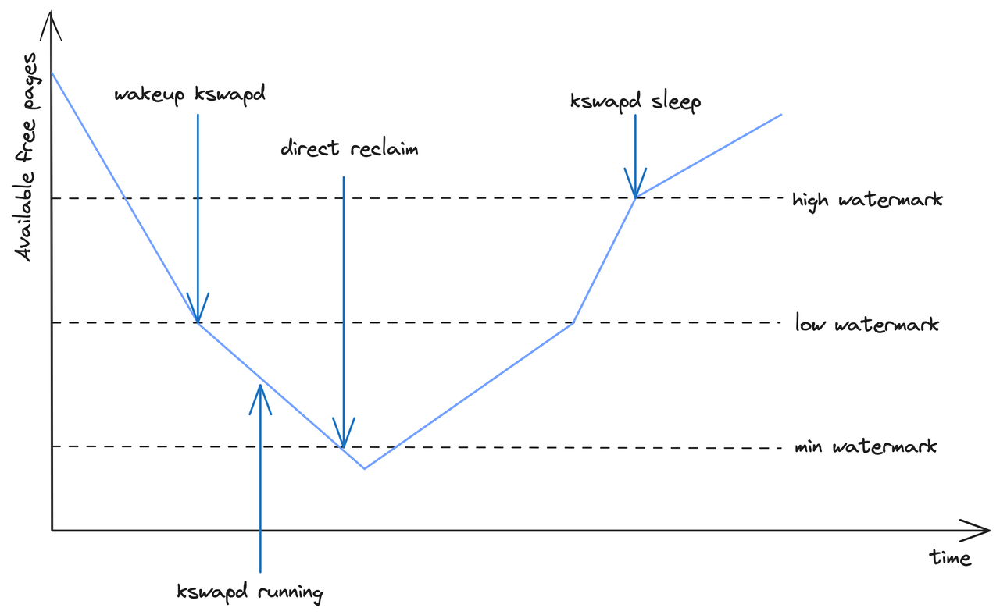
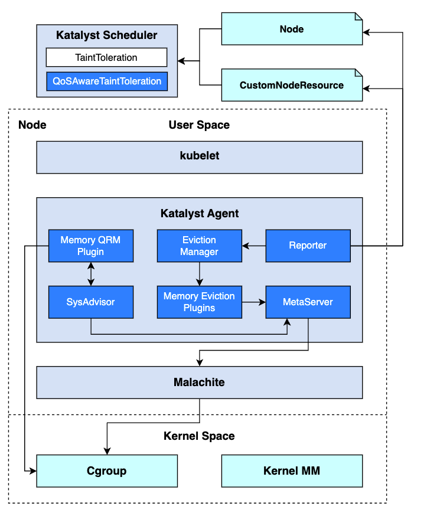
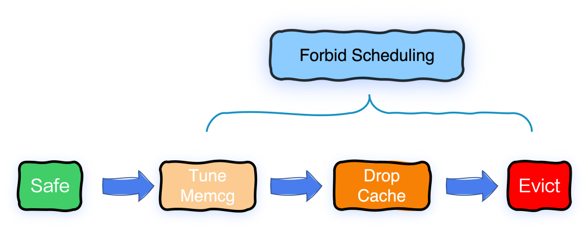
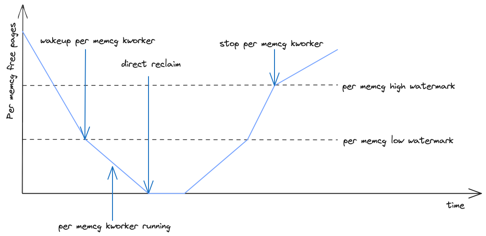
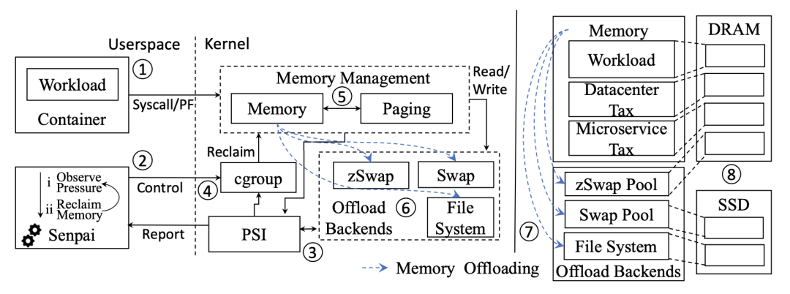

In the previous post[1], we introduced Katalyst - a QoS-based resource management system that helps ByteDance improve resource efficiency through colocation of online and offline workloads. 
In the colocation scenario, memory management is a crucial topic. On the one hand, when memory is tight on nodes or containers, the performance of the application may be affected, leading to issues like latency jitter or OOM (Out of Memory) errors. In colocation scenarios, where memory is overcommitted, this problem can become more severe. On the other hand, there might be some memory on nodes that is less frequently used but not released, resulting in less available memory that can be allocated to offline jobs, thus hindering effective overcommitment.
To address these issues, ByteDance has summarized its refined memory management strategies practiced during large-scale colocation into a user-space Kubernetes memory management solution called Memory Advisor, which has been open-sourced in the resource management system Katalyst. This article will focus on introducing the native memory management mechanisms of Kubernetes and the Linux kernel, their limitations, and how Katalyst, through Memory Advisor, improves memory utilization while ensuring the memory QoS for business applications.

## Limitations of native memory management
### Memory allocation and reclamation of Linux kernel
Due to the much faster access speed of memory compared to accessing disk, Linux tends to adopt a greedy memory allocation strategy, aiming for maximum allocation. It only triggers reclamation when the memory watermark is relatively high.
Memory allocation
The Linux kernel has fast path and slow path for 
#### Memory allocation:
1. Fast path: It first attempts to do a fast path memory allocation and then assesses whether the overall free memory level will fall below the Low Watermark after allocation. If it does, a quick memory reclaim is performed before re-evaluating the possibility of allocation. If the condition is still not met, it enters the slow path.
2. Slow path: In the slow path, it wakes up Kswapd to perform asynchronous memory reclaim and then attempts another round of fast memory allocation. If allocation fails, it tries memory compaction. If allocation is still unsuccessful, it attempts global direct memory reclaim, which involves scanning all zones and is time-consuming. If this also fails, it triggers a system-wide OOM event to release some memory and then retries fast memory allocation.
#### Memory reclamation
Memory reclamation can be categorized into two types based on the target: Memcg-based and Zone-based. The kernel's native memory reclamation methods include the following:
1. Memcg-level direct memory reclaim: If the Memory Usage of a cgroup reaches a threshold, it triggers synchronous memory reclamation at the memcg level to release some memory. If this is unsuccessful, it triggers a cgroup-level OOM event.
2. Fast path memory reclaim: As mentioned earlier in the discussion of fast path memory allocation, fast memory reclamation is quick because it only requires reclaiming the number of pages needed for the current allocation.
<br/>
<div align="center">
  <picture>
    
  </picture>
</div> 

3. Asynchronous memory reclaim: As shown in the diagram above, when the overall free memory of the system drops to the Low Watermark, Kswapd is awakened to asynchronously reclaim memory in the background until the High Watermark is reached.
4. Direct memory reclaim: As depicted in the diagram above, if the overall free memory of the system drops to the Min Watermark, it triggers global direct memory reclaim. Since this process is synchronous and occurs in the context of process memory allocation, it has a significant impact on the performance of the system.

### Kubernetes Memory Management
#### Memory limit
Kubelet sets the cgroup interface `memory.limit_in_bytes` based on the memory limits declared by each container within the pod, constraining the maximum memory usage for both the pod and its containers. When the memory usage of the pod or container reaches this limit, it triggers direct memory reclaim or even an OOM event.
#### Eviction
When the memory on a node becomes insufficient, K8s selects certain pods for eviction and marks the node with the taint `node.kubernetes.io/memory-pressure`, preventing additional pods from being scheduled on that node.
The trigger condition for memory eviction is when the node's working set reaches a threshold:
```
memory.available := node.status.capacity[memory] - node.stats.memory.workingSet
```
Where `memory.available` is the threshold configured by the user.
When sorting pods for eviction, the following criteria are considered:
1. First, it checks if a pod's memory usage exceeds its request; if so, it's prioritized for eviction.
2. Next, it compares the pods based on their priority, with lower-priority pods evicted first.
3. Finally, it compares the difference between a pod's memory usage and its request; pods with higher differences are evicted first.

#### OOM
If direct memory reclaim still cannot meet the memory demands of processes on the node, it will trigger a system-wide OOM event. When the Kubelet starts a container, it configures `/proc/<pid>/oom_score_adj` based on the QoS level of the container's associated pod and its memory request. This affects the order in which the container is selected for OOM Kill:
- For containers in critical pods or `Guaranteed` pods, their `oom_score_adj` is set to -997.
- For containers in `BestEffort` pods, their `oom_score_adj` is set to 1000.
- For containers in `Burstable` Pods, their `oom_score_adj` is calculated using the following formula:
`min{max[1000 - (1000 * memoryRequest) / memoryCapacity, 1000 + guaranteedOOM]}`

#### Memory QoS
Starting from version 1.22, K8s introduced the Memory QoS feature based on Cgroups v2 [2]. This feature ensures memory request guarantees for containers, thereby ensuring fairness in global memory reclaim among pods.
The specific Cgroups configuration is as follows:
- `memory.min`: Based on `requests.memory` configuration.
- `memory.high`: Based on `limits.memory * throttlingfactor` (or `nodeallocatablememory * throttlingfactor`) configuration.
- `memory.max`: Based on `limits.memory` (or `nodeallocatablememory`) configuration.

In version 1.27 of K8s, enhancements were made to the Memory QoS feature to address the following issues:
1. When container requests and limits are close, the throttle threshold configured in `memory.high` may not be effective due to `memory.high > memory.min` limitation.
2. The calculated `memory.high` may be too low, resulting in frequent throttling and affecting application performance.
3. The default value of `throttlingfactor` is too aggressive (0.8), causing frequent throttling for some Java applications that typically use more than 85% of memory.

To address these issues, the following optimizations were made:
1. Improvement in the calculation method of `memory.high`:
```
memory.high = floor{[requests.memory + memory throttling factor(limits.memory or node allocatable memory - requests.memory)]/pageSize} * pageSize
```
2. Adjustment of the default value of `throttlingfactor` to 0.9.

### Limitations
From the introductions in the previous two sections, we can identify the following limitations in both K8s and the Linux kernel memory management mechanisms:
1. **Lack of fairness mechanism in global memory reclamation:** In scenarios where memory overcommitment occurs, even if the memory usage of all containers is significantly lower than the limit, the entire node's memory may still reach the threshold for global memory reclaim. In the widely used Cgroups v1 environment, the memory request declared by containers is not reflected in Cgroups configuration by default, but serves only as a basis for scheduling. Therefore, there is a lack of fairness guarantee in global memory reclamation among pods, and available memory for containers is not divided proportionally based on requests, unlike CPU resources.
2. **Lack of priority mechanism in global memory reclamation:** In colocation scenarios, low-priority offline containers often run resource-intensive tasks and may request a large amount of memory. However, memory reclamation does not consider the priority of the applications, leading to high-priority online containers on nodes entering the slow path of direct memory reclaim, thereby disturbing the memory QoS of online applications.
3. **Delayed triggering of native eviction mechanisms:** K8s mainly ensures the priority and fairness of memory usage through kubelet-driven eviction. However, the triggering timing of native eviction mechanisms may occur after global memory reclamation, thus not taking effect promptly.
4. **Impact on application performance by memcg-level direct memory reclaim:** When the memory usage of a container reaches a threshold, memcg-level direct memory reclaim is triggered, causing latency in memory allocation, which may lead to business jitter.

## Katalyst Memory Advisor
### Overall architecture
The architecture of Katalyst Memory Advisor has undergone multiple discussions and iterations. It adopts a pluggable design, following a framework with plugins model, which enables developers to flexibly extend functionality and policies. The scopes of each component or module are as follows:
<br/>
<div align="center">
  <picture>
    
  </picture>
</div> 

- **Katalyst Agent:** Resource management agent running on each node. The following modules are involved for memory QoS management:
  - Eviction Manager: A framework that extends the native eviction policies of the kubelet. It periodically invokes interfaces of eviction plugins, retrieves the results of eviction policy calculations, and executes eviction actions.
  - Memory Eviction Plugins: Plugins for the Eviction Manager. The following plugins are involved for memory QoS management:
    - System Memory Pressure Plugin: Eviction strategy based on overall system-level memory pressure.
    - NUMA Memory Pressure Plugin: Eviction strategy based on NUMA Node-level memory pressure.
    - RSS Overuse Plugin: Eviction strategy based on Pod-level RSS overuse.
    - Reclaimed Resource Pressure Plugin: Eviction strategy based on memory resource fulfillment of offline pods.
  - Memory QRM Plugin: Memory resource management plugin. For memory QoS management, it handles Memcg configuration for offline pods and implements the Drop Cache action.
  - SysAdvisor: Algorithm module running on each node, supporting algorithm strategy extension through plugins. The following plugins are involved for memory QoS management:
    - Cache Reaper Plugin: Calculates the trigger timing for the Drop Cache action and identifies which pods need to have their cache dropped.
    - Memory Guard Plugin: Calculates the real-time Memory Limit for offline pods.
    - Memset Binder Plugin: Dynamically calculates which NUMA Node offline pods should be bound to.
  - Reporter: Out-of-band information reporting framework. For memory QoS management, it reports memory pressure-related Taints to Nodes or `CustomNodeResource` CRDs.
  - MetaServer: Metadata management component of Katalyst Agent. For memory QoS management, it provides metadata for Pods and Containers, caches metrics, and offers dynamic configuration capabilities.
- **Malachite:** Metrics data collection component running on each node. For memory QoS management, it provides memory-related metrics at the Node, NUMA, and Container levels.
- **Katalyst Scheduler:** The following plugins are involved for memory QoS management:
  - Native `TaintToleration` Plugin: Filters based on Node Taints.
  - Extended `QoSAwareTaintToleration` Plugin: Implements scheduling prohibitions based on Taints defined in `CustomNodeResource` CRDs for QoS awareness.

### Detailed design
#### Multi-dimensional interference detection
Memory Advisor performs periodic interference detection to proactively sense memory pressure and trigger corresponding mitigation measures. Currently, the following dimensions of interference detection are supported:
1. System and NUMA-level memory watermark: Comparing the free memory watermark at the system and NUMA levels with the threshold watermark of global asynchronous memory reclamation (Low Watermark), to avoid triggering global direct memory reclaim as much as possible.
2. Kswapd memory reclamation rate at the system level: If the rate of global asynchronous memory reclamation is high and continues for an extended period, it indicates significant memory pressure on the system, which may likely trigger global direct memory reclaim in the future.
3. Pod-level RSS overuse: Overcommitment can fully utilize a node's memory, but it cannot control whether the overcommitted memory is used for page cache or RSS. If the RSS usage of certain pods far exceeds their request, it may result in a high node memory watermark that cannot be reclaimed. This can affect other pods' inability to use sufficient page cache, leading to performance degradation, or it may result in an OOM event.
4. QoS-level memory resource fulfillment: By comparing the supply of reclaimed memory on the node with the total memory request of `reclaimed_cores` QoS level on that node, it calculates the memory resource fulfillment of offline jobs to prevent severe impacts on the service quality of offline jobs.

#### Multi-tiered mitigation measures
<br/>
<div align="center">
  <picture>
    
  </picture>
</div> 
Based on the different levels of abnormality feedback from interference detection, Memory Advisor supports multi-tiered mitigation measures. While avoiding interference with high-priority pods, it aims to minimize the impact on victim pods.

##### Forbid Scheduling
Forbidding scheduling is the least impactful mitigation measure. When any level of system abnormality is detected by interference detection, scheduling is forbidden on the node to prevent further scheduling of pods, thus preventing the situation from worsening.
Currently, Memory Advisor supports this feature for all pods through Node Taint. In the future, we will enable the scheduler to be aware of taints extended in `CustomNodeResource` CRDs to achieve fine-grained scheduling prohibition for `reclaimed_cores` pods.

##### Tune Memcg
Tune Memcg is a mitigation measure with a relatively minor impact on victim pods. When the degree of abnormality detected by interference detection is low, Tune Memcg operations are triggered. This selects some `reclaimed_cores` pods and configures them with higher memory reclamation trigger thresholds to trigger memory reclamation earlier, thereby avoiding triggering global direct memory reclaim as much as possible.
Tune Memcg is not enabled by default because it requires the use of veLinux kernel's open-source Memcg asynchronous memory reclamation feature[3], which does not affect usage.

##### Drop Cache
Drop Cache is a mitigation measure with a moderate impact on victim pods. When the degree of abnormality detected by interference detection is moderate, drop cache operations are triggered. This selects some `reclaimed_cores` pods with high cache usage and forcefully releases their cache to avoid triggering global direct memory reclaim as much as possible.
In Cgroups v1 environments, cache release is triggered through the `memory.force_empty` interface:
```
echo 0 > memory.force_empty
```
In Cgroups v2 environments, cache release is triggered by writing a large value to the `memory.reclaim` interface, such as:
```
echo 100G > memory.reclaim
```
As drop cache is a time-consuming operation, we have implemented an asynchronous task execution framework to avoid blocking the main process. Technical details of this part will be discussed in future articles.

##### Eviction
Eviction is a measure with a significant impact on victim pods, but it is the fastest and most effective fallback measure. When a high degree of abnormality is detected by interference detection, eviction at the system or NUMA level (or only for `reclaimed_cores` pods) is triggered to effectively avoid triggering global direct memory reclaim.
Memory Advisor supports users to configure custom sorting logic for pods to be evicted. If users have not configured it, the default sorting logic is as follows:
1. Sort pods based on their QoS level, with `reclaimed_cores` > `shared_cores` / `dedicated_cores`.
2. Sort pods based on their priority, with lower priority pods evicted first.
3. Sort pods based on their memory usage, with higher usage pods evicted first.
We have abstracted an eviction manager framework in Katalyst agent. This framework delegates eviction policies to plugins and consolidates eviction actions in the manager, offering the following advantages:
- Plugins and managers can communicate through local function calls or gRPC, allowing flexible plugin start and stop.
- The manager can easily support governance operations such as filtering, rate limiting, sorting, and auditing for eviction.
- Support for dry run on plugins in the manager, allowing thorough validation of strategies before they take effect.

#### Resource cap for reclaimed_cores
To prevent offline containers from excessively using memory and affecting the service quality of online containers, we limit the total memory usage of `reclaimed_cores` pods through a resource cap.
Specifically, we have expanded a memory guard plugin in SysAdvisor. This plugin periodically calculates the total amount of memory that `reclaimed_cores` pods can use as a whole and accordingly write `memory.limit_in_bytes` file of the `BestEffort` cgroup through the memory QRM plugin.

#### Memory migration
For applications like Flink, the performance of services is strongly correlated with memory bandwidth and memory latency, and they also consume a significant amount of memory. The default memory allocation strategy prioritizes memory allocation from the local NUMA node to achieve lower memory access latency. However, on the other hand, the default memory allocation strategy may lead to uneven memory usage across NUMA nodes, causing certain NUMA nodes to become hotspots under excessive pressure, which severely impacts service performance and leads to latency issues.
Therefore, we use Memory Advisor to monitor the memory watermark of each NUMA node and dynamically adjust the NUMA node bindings of containers for memory migration to prevent any NUMA node from becoming a hotspot.
During the implementation of the memory dynamic migration feature in production environments, we encountered exceptional situations that could lead to system hang-ups. As a result, we optimized the method of memory migration. This practical experience will be elaborated on in subsequent blogs.

#### Differentiated memcg-level reclamation strategy
<br/>
<div align="center">
  <picture>
    
  </picture>
</div> 

Given that memcg-level direct memory reclaim can significantly impact application performance, the kernel team at ByteDance has enhanced the Linux kernel (i.e. veLinux) with memcg-level asynchronous memory reclamation features, which have been open-sourced [4].
In colocation scenarios, the typical I/O activities of online applications involve reading and writing logs, whereas those of offline tasks involve more frequent file I/O operations, with page cache having a significant impact on the performance of offline jobs. Therefore, through Memory Advisor, we support differentiated memory reclamation strategies at the memcg level:
- For applications requiring a large amount of page cache (such as offline jobs), users can specify a relatively lower memcg-level asynchronous memory reclamation threshold through pod annotations. This conservative memory reclamation approach allows for more page cache usage.
- Conversely, for applications requiring minimized performance degradation due to direct memory reclaim, users can configure a relatively aggressive memcg-level asynchronous reclamation strategy through pod annotations.
This feature is not enabled by default as it requires patches from the veLinux kernel.

## Future plans
In subsequent versions of Katalyst, we will continue to iterate on Memory Advisor to enhance its support for a wider range of user scenarios.

### Decoupling some capabilities from QoS
Memory Advisor has extended some enhanced memory management capabilities in colocation scenarios, where some of these capabilities are orthogonal to QoS and remain applicable even in non-colocation scenarios.
Therefore, in subsequent iterations, we will decouple features such as memcg-level differentiated reclamation strategy, interference detection, and mitigation from QoS enhancement. This will turn them into finely-grained memory management capabilities applicable to general scenarios, enabling users in non-colocation scenarios to utilize them as well.

### OOM priority
In the context mentioned earlier, Kubernetes configures different `oom_score_adj` values for containers based on pod's QoS level. However, the final OOM Score can still be influenced by other factors such as memory usage.
In tidal colocation [5] scenarios, where offline pods belong to the same QoS level, there may be no guarantee that offline pods will be OOM-killed before online pods. Therefore, there is a need to introduce a Katalyst QoS enhancement: QoS priority. Memory Advisor should be able to configure corresponding `oom_score_adj` values for containers belonging to different QoS priority levels in user space, ensuring strict OOM sequence for offline pods.
Additionally, the ByteDance kernel team recently submitted a patch to the Linux kernel [6], aiming to programmatically customize the kernel's OOM behavior through BPF hooks. This initiative seeks to enhance flexibility in defining OOM strategies.

### Cold memory offloading
There may be some less frequently used memory (referred to as cold memory) on the node that has not been released, leading to a limited amount of memory available for offline job usage. This situation prevents effective memory overcommitment, as the memory that could be allocated to offline jobs remains underutilized.
<br/>
<div align="center">
  <picture>
    
  </picture>
</div> 
To increase the amount of memory available for allocation, we have referenced Meta's Transparent Memory Offloading (TMO) paper [7]. In the future, Memory Advisor will utilize the procfs-based memory pressure monitoring framework (PSI) in user space to detect memory pressure. When memory pressure is low, memory reclamation will be triggered proactively. Additionally, we will leverage the DAMON sub-module for memory hotness detection to gather information on memory usage patterns. This information will be used to offload cold memory to relatively inexpensive storage devices or compress it using zRAM, thereby saving memory space and improving memory resource utilization.
The technical details of this feature will be elaborated on in subsequent blogs.

## Summary
At ByteDance, Katalyst is deployed across over 900,000 nodes, managing tens of millions of cores and unifying the management of various workload types, including microservices, search, advertising, storage, big data, and AI jobs. Katalyst has improved daily resource utilization at ByteDance from 20% to 60%, while ensuring that the QoS requirement of various workload types is satisfied at the same time.
In the future, Katalyst Memory Advisor will continue to iterate and optimize. Further technical insights into features such as cold memory offloading and memory migration optimizations will be explained in subsequent blogs. Stay tuned!

## References
- [1] A brief introduction to Katalyst: https://www.cncf.io/blog/2023/12/26/katalyst-a-qos-based-resource-management-system-for-workload-colocation-on-kubernetes/
- [2] Kubernetes eviction strategy: https://kubernetes.io/docs/concepts/scheduling-eviction/node-pressure-eviction/
- [3] Memory QoS KEP: https://github.com/kubernetes/enhancements/tree/master/keps/sig-node/2570-memory-qos
- [4] Memcg-level async reclaim：https://github.com/bytedance/kernel/commit/7d7386ec89caf078f21836c5cae33ffa886125c4
- [5] Tidal colocation: https://gokatalyst.io/docs/user-guide/tidal-colocation/
- [6] BPF hook for selecting victim task during OOM events: https://lore.kernel.org/lkml/20230804093804.47039-1-zhouchuyi@bytedance.com/
- [7] TMO paper：https://www.pdl.cmu.edu/ftp/NVM/tmo_asplos22.pdf