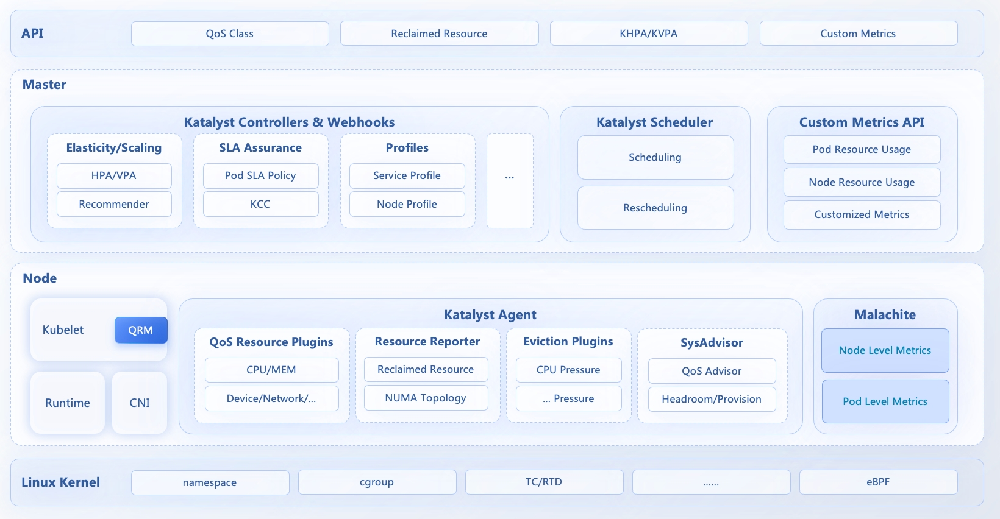

As shown in the architecture below, katalyst mainly contains three layers. For user-side API, katalyst defines a suit of QoS model along with multiple enhancements to match up with QoS requirements for different kinds of workload. Users can deploy their workload with different QoS requirements, and katalyst daemon will try to allocate proper resources and devices for those pods to satisfy their QoS requirements. This allocation process will work both at pod admission phase and runtime, taking into consideration the resource usage and QoS class of pods running on the same node. Besides, centralized components will cooperate with daemons to provide better resource adjustments for each workload with a cluster-level perspective.

  <picture>
    
  </picture>

## Components
Katalyst contains centralized components that are deployed as deployments, and agents that run as deamonsets on each and every node.

### Centralized Components

#### Katalyst Controllers/Webhooks

Katalyst controllers provide cluster-level abilities, including service profiling, elastic resource recommendation, core Custom Resource lifecycle management, and centralized eviction strategies run as a backstop. Katalyst webhooks are responsible for validating QoS configurations, and mutating resource requests according to service profiling.

#### Katalyst Scheduler

Katalyst scheduler is developed based on the scheduler v2 framework to provide the scheduling functionality for hybrid deployment and topology-aware scheduling scenarios

#### Custom Metrics API

Custom metrics API implements the standard custom-metrics-apiserver interface, and is responsible for collecting, storing, and inquiring metrics. It is mainly used by elastic resource recommendation and re-scheduling in the katalyst system.

### Daemon Components

#### QoS Resource Manager

QoS Resource Manager (QRM for short) is designed as an extended framework in kubelet, and it works as a new hint provider similar to Device Manager. But unlike Device Manager, QRM aims at allocating nondiscrete resources (i.e. cpu/memory) rather than discrete devices, and it can adjust allocation results dynamically and periodically based on container running status. QRM is implemented in kubewahrf enhanced kubernetes, and if you want to get more information about QRM, please refer to [qos-resource-manager](https://github.com/kubewharf/katalyst-core/blob/main/docs/proposals/qos-management/qos-resource-manager/20221018-qos-resource-manager.md).

#### Katalyst agent

Katalyst Agent is designed as the core daemon component to implement resource management according to QoS requirements and container running status. Katalyst agent contains several individual modules that are responsible for different functionalities. These modules can either be deployed as a monolithic container or separate ones.
- Eviction Manager is a framework for eviction strategies. Users can implement their own eviction plugins to handle contention for each resource type. For more information about eviction manager, please refer to [eviction-manager](https://github.com/kubewharf/katalyst-core/blob/main/docs/proposals/qos-management/eviction-manager/20220424-eviction-manager.md).
- Resource Reporter is a framework for different CRDs or different fields in the same CRD. For instance, different fields in CNR may be collected through different sources, and this framework makes it possible for users to implement each resource reporter with a plugin. For more information about reporter manager, please refer to [reporter-manager](https://github.com/kubewharf/katalyst-core/blob/main/docs/proposals/qos-management/reporter-manager/20220515-reporter-manager.md).
- SysAdvisor is the core node-level resource recommendation module, and it uses statistical-based, indicator-based, and ml-based algorithms for different scenarios. For more information about sysadvisor, please refer to [sys-advisor](https://github.com/kubewharf/katalyst-core/blob/main/docs/proposals/qos-management/wip-20220615-sys-advisor.md).
- QRM Plugin works as a plugin for each resource with static or dynamic policies. Generally, QRM Plugins receive resource recommendations from SysAdvisor, and export controlling configs through CRI interface embedded in QRM Framework.

#### Malachite

Malachite is a unified metrics-collecting component. It is implemented out-of-tree, and serves node, numa, pod and container level metrics through an http endpoint from which katalyst will query real-time metrics data. In a real-world production environment, you can replace malachite with your own metric implementations.
