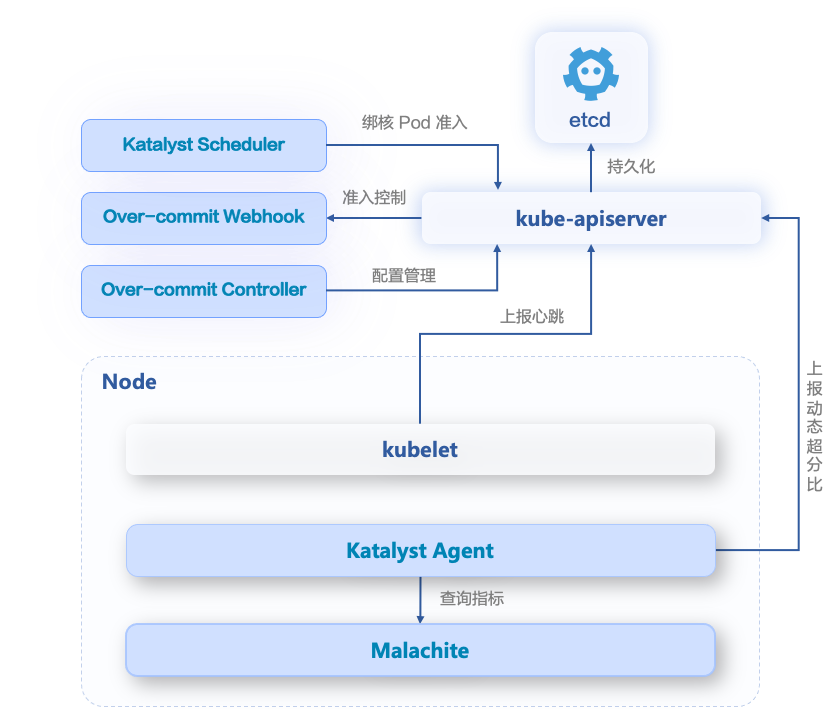

## Introduction
The resource usage of online business often fluctuates with variations in the number times your service gets called, showing evident tidal characteristics. To ensure the stability of operations, users typically base their resource requests on the resource consumption during peak hours, and service owners tend to over-apply for resources which leads to resource wastage.

Katalyst provides the capability of colocation as one of the ways to address the aforementioned issues. However, it may not be convenient to implement colocation in some scenarios:
- Only online services are involved, which means most of the services share the peak hours.
- Applying for reclaimed resource requires modifications to the applications or even the platform.

Katalyst offers a simple resource overcommitment solution that is transparent to the business side, facilitating users in quickly improving resource utilization.

  <picture>
    
  </picture>

- Over-commit Webhook：Hijacks kubelet heartbeat request and oversell allocatable resource according to user configuration.
- Over-commit Controller：Manage `nodeovercommitconfig` CRD.
- Katalyst Agent：Ensure node performance and stability using interference detection and eviction; dynamically calculate overcommit ratio according to metrics.
- Katalyst Scheduler：Admitting pods that binds to specific cpusets to avoid failures of running pods that requires cpusets binding.