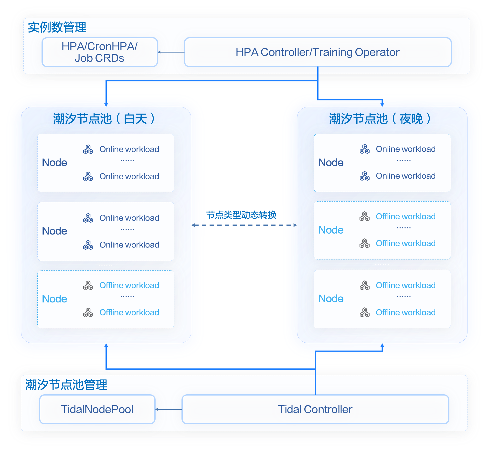

## Introduction
By assigning differentiated Quality of Service (QoS) classes to applications, Katalyst can achieve colocation on a single-machine dimension through resource isolation and dynamic resource control capabilities. While this colocation mode can achieve optimal resource efficiency improvement, it also adds complexity to the infrastructure. Additionally, because concepts like Reclaimed resources are introduced, adapting to colocation often requires some business-side adjustments. To enable users to implement colocation capabilities at a lower cost, Katalyst introduces the Tidal Colocation.

<div align="center">
  <picture>
    
  </picture>
</div>

In Tidal Colocation, the concept of a tidal node pool is introduced, and the nodes in the cluster are categorized into two types: "online" and "offline." The idea of tidal colocation is primarily divided into two parts:

- Workload autoscaling: Utilizing various horizontal scaling capabilities such as HPA, CronHPA, etc., to manage the number of replicas for online workloads. This allows resources to be freed up during the night for offline workloads.

- Tidal node pool management: The controller, based on predefined policies, performs binpacking on the nodes in the tidal node pool. This process reallocates the freed-up resources as whole machines to be used by offline workloads. In other words, a node can run either online or offline workloads, but not at the same time.

## Installation
### Prerequisite
- Katalyst >= v0.4.0

### Create a kind cluster
```bash
kind create cluster --config - <<EOF
# this config file contains all config fields with comments
kind: Cluster
apiVersion: kind.x-k8s.io/v1alpha4

# 1 control plane node and 6 workers
nodes:
# the control plane node config
- role: control-plane
# the six workers
- role: worker
- role: worker
- role: worker
- role: worker
- role: worker
- role: worker
EOF
```

### Install Katalyst tidal colocation
```bash
helm repo add https://kubewharf.github.io/charts
helm install tidal-colocation -n katalyst-system --create-namespace kubewharf/katalyst-tidal-colocation
```

## Use tidal colocation
1. Label the nodes so that it belongs to a tide node pool
```bash
kubectl label node kind-worker kind-worker2 kind-worker3 kind-worker4 kind-worker5 kind-worker6 tidal-node-pool=demo
```

2. Create a TideNodePool rule
```bash
kubectl create -f - <<EOF
apiVersion: tide.katalyst.kubewharf.io/v1alpha1
kind: TideNodePool
metadata:
  name: tidenodepool-demo
spec:
  nodeConfigs:
    nodeSelector:
      # This match the label we added to nodes
      tidal-node-pool: "demo"
    # The reserved nodes for online and offline workloads in tide node pool
    reserve:
      offline: 25%
      online: 10%
EOF
```
Katalyst tidal colocation controller will reserve nodes from tide node pool for online and offline workloads respectively. For the rest of the nodes in tide node pool, tidal colocation controller will calculate the number of nodes for online workloads according to their resource requests, and the mark the rest for offline workloads.

3. Check the status(i.e. labels) of the nodes in tide node pool

Nodes for online workloads
```bash
kubectl get nodes -l tide.katalyst.kubewharf.io/node-type=online
```
```console
NAME           STATUS   ROLES    AGE   VERSION
kind-worker    Ready    <none>   91m   v1.26.3
kind-worker4   Ready    <none>   91m   v1.26.3
```

Nodes for offline workloads
```bash
kubectl get nodes -l tide.katalyst.kubewharf.io/node-type=offline
```
```console
NAME           STATUS   ROLES    AGE   VERSION
kind-worker2   Ready    <none>   91m   v1.26.3
kind-worker3   Ready    <none>   91m   v1.26.3
kind-worker5   Ready    <none>   91m   v1.26.3
kind-worker6   Ready    <none>   91m   v1.26.3
```

Since we have not deploy any online workloads, 4 out of 6 nodes are marked for offline workloads.

4. Deploy online and offline workloads

Create online workloads
```yaml
kind: Deployment
apiVersion: apps/v1
metadata:
  name: tide-online
spec:
  replicas: 20
  selector:
    matchLabels:
      app: tide-online
  template:
    metadata:
      labels:
        # Label for online workload
        tide.katalyst.kubewharf.io/pod-type: online
        app: tide-online
    spec:
      tolerations:
      # Tolerate taints
      - key: "tide.katalyst.kubewharf.io/offline-not-used"
        operator: "Exists"
      # Select online nodes for online workloads
      nodeSelector:
        tide.katalyst.kubewharf.io/node-type: online
      containers:
      - name: busybox
        image: busybox
        command: ["sleep", "36000"]
        resources:
          requests:
            cpu: "1"
            memory: "2Gi"
```
Create offline workloads
```yaml
kind: Deployment
apiVersion: apps/v1
metadata:
  name: tide-offline
spec:
  replicas: 10
  selector:
    matchLabels:
      app: tide-offline
  template:
    metadata:
      labels:
        tide.katalyst.kubewharf.io/pod-type: offline
        app: tide-offline
    spec:
      tolerations:
      - key: "tide.katalyst.kubewharf.io/online-not-used"
        operator: "Exists"
      nodeSelector:
        tide.katalyst.kubewharf.io/node-type: offline
      containers:
      - name: busybox
        image: busybox
        command: ["sleep", "36000"]
        resources:
          requests:
            cpu: "1"
            memory: "2Gi"
```

A few things we need to pay attention to when deploying workloads:
- The `tide.katalyst.kubewharf.io/pod-type: online` label is used by the controller to know which pods are online workloads and is hardcoded for now.
- Node labels and taints are managed by tidal colocation controller. The toleration and node selector are to enforce that online and offline workloads runs respectively on separate group of nodes.

5. Check the status of the workloads

Online workloads
```bash
kubectl get pods -l app=tide-online
```
```console
NAME                           READY   STATUS    RESTARTS   AGE
tide-online-7db98d955b-2s4ds   1/1     Running   0          14m
tide-online-7db98d955b-4fzbs   1/1     Running   0          12m
tide-online-7db98d955b-4qc94   1/1     Running   0          13m
tide-online-7db98d955b-5whwq   1/1     Running   0          14m
tide-online-7db98d955b-7f9jq   0/1     Pending   0          7m37s
tide-online-7db98d955b-czshr   1/1     Running   0          12m
tide-online-7db98d955b-d64gf   1/1     Running   0          14m
tide-online-7db98d955b-ff8x8   0/1     Pending   0          7m37s
tide-online-7db98d955b-hrtlt   1/1     Running   0          14m
tide-online-7db98d955b-lhlrd   0/1     Pending   0          7m37s
tide-online-7db98d955b-msv9n   1/1     Running   0          14m
tide-online-7db98d955b-ntwsq   1/1     Running   0          14m
tide-online-7db98d955b-p2swb   1/1     Running   0          14m
tide-online-7db98d955b-p6rwp   1/1     Running   0          14m
tide-online-7db98d955b-qwbzq   1/1     Running   0          12m
tide-online-7db98d955b-rn6dx   1/1     Running   0          13m
tide-online-7db98d955b-tbpbp   1/1     Running   0          12m
tide-online-7db98d955b-tnv9f   0/1     Pending   0          7m37s
tide-online-7db98d955b-txsbb   1/1     Running   0          12m
tide-online-7db98d955b-w26zl   0/1     Pending   0          7m37s
```

Offline workloads
```bash
kubectl get pods -l app=tide-offline
```
```console
NAME                            READY   STATUS    RESTARTS   AGE
tide-offline-7766f9985b-5t5xr   1/1     Running   0          6m19s
tide-offline-7766f9985b-brlcc   0/1     Pending   0          6m19s
tide-offline-7766f9985b-gcdqj   0/1     Pending   0          6m19s
tide-offline-7766f9985b-gf6x5   0/1     Pending   0          6m19s
tide-offline-7766f9985b-k4w4t   0/1     Pending   0          6m19s
tide-offline-7766f9985b-lw7qm   0/1     Pending   0          6m19s
tide-offline-7766f9985b-mvszr   1/1     Running   0          6m19s
tide-offline-7766f9985b-srqc6   0/1     Pending   0          6m19s
tide-offline-7766f9985b-x28mf   1/1     Running   0          6m19s
tide-offline-7766f9985b-xmtnw   0/1     Pending   0          6m19s
```

Online nodes
```bash
kubectl get nodes -l tide.katalyst.kubewharf.io/node-type=online
```
```console
NAME           STATUS   ROLES    AGE    VERSION
kind-worker    Ready    <none>   112m   v1.26.3
kind-worker2   Ready    <none>   112m   v1.26.3
kind-worker4   Ready    <none>   112m   v1.26.3
kind-worker5   Ready    <none>   112m   v1.26.3
kind-worker6   Ready    <none>   112m   v1.26.3
```

Offline nodes
```bash
kubectl get nodes -l tide.katalyst.kubewharf.io/node-type=offline
```
```console
NAME           STATUS   ROLES    AGE    VERSION
kind-worker3   Ready    <none>   113m   v1.26.3
```

6. Reduce replicas of online workloads and check the status of the workloads again
```bash
kubectl get pods
```
```console
NAME                            READY   STATUS    RESTARTS   AGE
tide-offline-7766f9985b-5t5xr   1/1     Running   0          9m30s
tide-offline-7766f9985b-brlcc   0/1     Pending   0          9m30s
tide-offline-7766f9985b-gcdqj   1/1     Running   0          9m30s
tide-offline-7766f9985b-gf6x5   1/1     Running   0          9m30s
tide-offline-7766f9985b-k4w4t   1/1     Running   0          9m30s
tide-offline-7766f9985b-lw7qm   1/1     Running   0          9m30s
tide-offline-7766f9985b-mvszr   1/1     Running   0          9m30s
tide-offline-7766f9985b-srqc6   1/1     Running   0          9m30s
tide-offline-7766f9985b-x28mf   1/1     Running   0          9m30s
tide-offline-7766f9985b-xmtnw   1/1     Running   0          9m30s
tide-online-7db98d955b-4fzbs    1/1     Running   0          15m
tide-online-7db98d955b-msv9n    1/1     Running   0          17m
tide-online-7db98d955b-pp72k    1/1     Running   0          56s
tide-online-7db98d955b-rn6dx    1/1     Running   0          17m
tide-online-7db98d955b-zm7sz    1/1     Running   0          56s
```

Online nodes
```bash
kubectl get nodes -l tide.katalyst.kubewharf.io/node-type=online
```
```console
NAME           STATUS   ROLES    AGE    VERSION
kind-worker    Ready    <none>   118m   v1.26.3
kind-worker6   Ready    <none>   118m   v1.26.3
```

Offline nodes
```bash
kubectl get nodes -l tide.katalyst.kubewharf.io/node-type=offline
```
```console
NAME           STATUS   ROLES    AGE    VERSION
kind-worker2   Ready    <none>   118m   v1.26.3
kind-worker3   Ready    <none>   118m   v1.26.3
kind-worker4   Ready    <none>   118m   v1.26.3
kind-worker5   Ready    <none>   118m   v1.26.3
```

We can observe a few things in this tidal colocation excercise:
- When we manually scaled up the replicas of online workloads (i.e. Peak of online services), most of the nodes are marked by the controller for online workloads.
- Controller still reserves 1 node for offline workloads according to `TideNodePool` config, so that offline workload won't starve.
- When we manually scaled down the replicas of online workloads (i.e. Valley of online services), resource usage of most of the nodes are low. Tidal colocation can mark most of the nodes for offline workloads to improve resource efficiency.